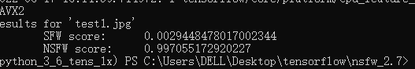

# 基于 NSFW Model 色情图片识别鉴黄 后面更新视频检测

### 识别效果


推荐SFW 0.98 色情 NSFW 0.015




推荐SFW 0.00 色情 NSFW 0.99 为色情图片

[github.com原文地址 ](https://github.com/mdietrichstein/tensorflow-open_nsfw)

### 环境条件

所有代码都应该与Python 3.6and兼容Tensorflow 1.x（用 1.12 测试）。模型实现可以在 中找到model.py

### 作者python环境

```
Python 3.6.13 :: Anaconda, Inc.
```

### pip list

```
absl-py==1.1.0
astor==0.8.1
cached-property==1.5.2
certifi==2021.5.30
cycler==0.11.0
dataclasses==0.8
decorator==4.4.2
gast==0.5.3
grpcio==1.46.3
h5py==3.1.0
imageio==2.15.0
importlib-metadata==4.8.3
Keras-Applications==1.0.8
Keras-Preprocessing==1.1.2
kiwisolver==1.3.1
Markdown==3.3.7
matplotlib==3.3.4
networkx==2.5.1
numpy==1.16.2
Pillow==8.4.0
protobuf==4.21.0
pyparsing==3.0.9
python-dateutil==2.8.2
PyWavelets==1.1.1
scikit-image==0.17.2
scipy==1.5.4
six==1.16.0
tensorboard==1.12.2
tensorflow==1.12.0
termcolor==1.1.0
tifffile==2020.9.3
typing_extensions==4.1.1
Werkzeug==2.0.3
wincertstore==0.2
zipp==3.6.0

```

### 安装依赖

```
方法 1.
pip install tensorflow== 1.12
pip installnumpy==1.16.2
pip install scikit-image==0.17.2

方法 2.
pip install -r requirements.txt
```

### 使用方法

这里注意一下只支持.jpg类型图片


```
python classify_nsfw.py -m data/open_nsfw-weights.npy data/test.jpg	
```

```
SFW score推荐比例  , NSFW score 不推荐比例
Results for 'test.jpg'
	SFW score:	0.9355766177177429 
	NSFW score:	0.06442338228225708 
```

## 出现错误

```
caffe: TypeError: _open() got an unexpected keyword argument ‘as_grey‘
 “as_grey” 实际应当修改为 “as_gray”，原因是 scikit-image 的 0.17.2 版本修改了参数名称

ValueError: Object arrays cannot be loaded when allow_pickle=False
自Numpy 1.16.3版本发行之后，函数 numpy.load() 和 numpy.lib.format.read_array() 采用allow_pickle关键字，现在默认为False以响
pip install numpy=1.16.2
```

__Note:__ Currently only jpeg images are supported.

`classify_nsfw.py` accepts some optional parameters you may want to play around with:

```
usage: classify_nsfw.py [-h] -m MODEL_WEIGHTS [-l {yahoo,tensorflow}]
                        [-t {tensor,base64_jpeg}]
                        input_jpeg_file

positional arguments:
  input_file            Path to the input image. Only jpeg images are
                        supported.

optional arguments:
  -h, --help            show this help message and exit
  -m MODEL_WEIGHTS, --model_weights MODEL_WEIGHTS
                        Path to trained model weights file
  -l {yahoo,tensorflow}, --image_loader {yahoo,tensorflow}
                        image loading mechanism
  -i {tensor,base64_jpeg}, --input_type {tensor,base64_jpeg}
                        input type
```

__-l/--image-loader__

The classification tool supports two different image loading mechanisms.

* `yahoo` (default) replicates yahoo's original image loading and preprocessing. Use this option if you want the same
  results as with the original implementation
* `tensorflow` is an image loader which uses tensorflow exclusively (no dependencies on `PIL`, `skimage`, etc.). Tries
  to replicate the image loading mechanism used by the original caffe implementation, differs a bit though due to
  different jpeg and resizing implementations.
  See [this issue](https://github.com/mdietrichstein/tensorflow-open_nsfw/issues/2#issuecomment-346125345) for details.

__Note:__ Classification results may vary depending on the selected image loader!

__-i/--input_type__

Determines if the model internally uses a float tensor (`tensor` - `[None, 224, 224, 3]` - default) or a base64 encoded
string tensor (`base64_jpeg` - `[None, ]`) as input. If `base64_jpeg` is used, then the `tensorflow` image loader will
be used, regardless of the _-l/--image-loader_ argument.

### Tools

The `tools` folder contains some utility scripts to test the model.

__create_predict_request.py__

Takes an input image and generates a json file suitable for prediction requests to a Open NSFW Model deployed
with [Google Cloud ML Engine](https://cloud.google.com/ml-engine/docs/concepts/prediction-overview) (`gcloud ml-engine predict`)
or [tensorflow-serving](https://www.tensorflow.org/serving/).

__export_savedmodel.py__

Exports the model using the tensorflow serving export api (`SavedModel`). The export can be used to deploy the model
on [Google Cloud ML Engine](https://cloud.google.com/ml-engine/docs/concepts/prediction-overview)
, [Tensorflow Serving]() or on mobile (haven't tried that one yet).

__export_tflite.py__

Exports the model in [TFLite format](https://www.tensorflow.org/lite/). Use this one if you want to run inference on
mobile or IoT devices. Please note that the `base64_jpeg` input type does not work with TFLite since the standard
runtime lacks a number of required tensorflow operations.

__export_graph.py__

Exports the tensorflow graph and checkpoint. Freezes and optimizes the graph per default for improved inference and
deployment usage (e.g. Android, iOS, etc.). Import the graph with `tf.import_graph_def`.